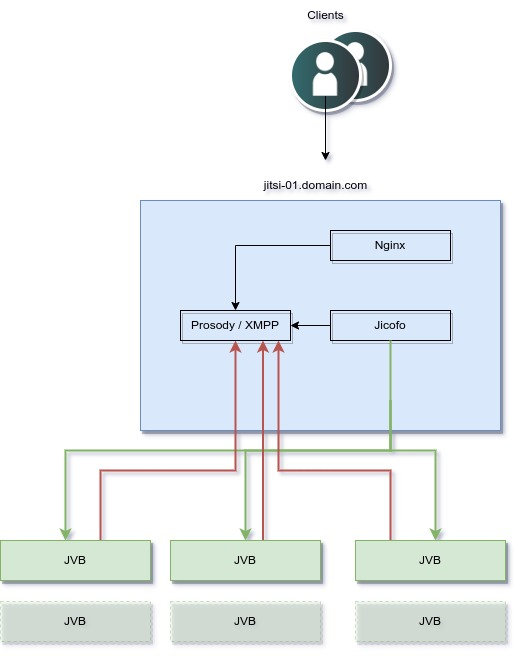

# Manually Deploy a Jitsi Cluster on Akamai 

Create a scalable Jitsi Meet cluster using Ansible. We can use this playbook to create the initial deployment then scale up and down as needed. The Jitsi Videobridges (JVB) is the only component that is scaled. All JVBs connect to the Jitsi meet instance running XMPP (Prosody) on port 5222.

Jicofo (Jitsi Conference Focus) is configured to split the traffic between all of the JVBs via Octo. The Jitsi cluster is provisioned with as a minimal installation for the PoC.




Jitsi is a free, open source video conferencing and communication platform that provides a secure, stable, and free alternative to other popular video conferencing services. With Jitsi, you can use built-in features to limit meeting access with passwords or stream on YouTube so anyone can attend.

This guide walks you through how to create a scalable Jitsi Meet cluster using Ansible. The provided Ansible playbook creates an initial deployment that can then be scaled up or down as needed.

If you wish to deploy Jitsi automatically rather than manually, consider either our single-instance [Jitsi Marketplace deployment](https://deploy-preview-7012--nostalgic-ptolemy-b01ab8.netlify.app/docs/products/tools/marketplace/guides/jitsi/) or our [Jitsi Cluster Marketplace deployment](https://deploy-preview-7012--nostalgic-ptolemy-b01ab8.netlify.app/docs/products/tools/marketplace/guides/jitsi-cluster/).

**Supported distribution:**
- Ubuntu 22.04

**Python Version:**
- >= 3.8

## Installation

Create a virtual environment to isolate dependencies from other packages on your system.

```
python3 -m venv env
source env/bin/activate
pip install -U pip
```

Install Ansible collections and required Python packages.

```
pip install -r requirements.txt
ansible-galaxy collection install -r collections.yml
```

## Setup

All secrets are encrypted with Ansible vault for best practices. To run the next commands you will need to export `VAULT_PASSWORD` so that secrets can be encrypted. Let's go ahead and export:

```command
export VAULT_PASSWORD=MyVaultPassword
```

Please replace `MyVaultPassword` with your own. 

Encrypt your Linode root password and valid APIv4 token with ansible-vault. Replace the value of @R34llyStr0ngP455w0rd! with your own strong password and `LINODE_TOKEN` with your own access token.

```
ansible-vault encrypt_string '@R34llyStr0ngP455w0rd!' --name 'root_password'
ansible-vault encrypt_string '@R34llyStr0ngP455w0rd!' --name 'sudo_password'
ansible-vault encrypt_string 'LINODE_TOKEN' --name 'api_token'
```

Copy the generated outputs to the group_vars/galera/secret_vars file.

```
root_password: !vault |
          $ANSIBLE_VAULT;1.1;AES256
          38306438386334663834633634363930343233373066353234616363356534653033346232333538
          3163313031373138383965383739356339663831613061660a666332636564356236656331323361
          61383134663166613462363633646330678356561386230383332313564643135343538383161383236
          6432396332643232620a393630633132336134613039666336326337376566383531393464303864
          34306435376534653961653739653232383262613336383837343962633565356546
sudo_password: !vault |
          $ANSIBLE_VAULT;1.1;AES256
          38306438386334663834633634363930343233373066353234616363356534653033346232333538
          3163313031373138383965383739356339663831613061660a666332636564356236656331323361
          61383134663166613462363633646330356561386230383332313564643135343538383161383236
          6432396332643232620a393630633sdf32336134613039666336326337376566383531393464303864
          34306435376534653961653739653232383262613336383837343962633565356546
api_token: !vault |
          $ANSIBLE_VAULT;1.1;AES256
          38306438386334663834633634363930343233373066353234616363356534653033346232333538
          3163313031373138383965383739356339663831613061660a666332636564356236656331323361
          6138313466316661346236363364567330356561386230383332313564643135343538383161383236
          6432396332643232620a393630633132336134613039666336326337376566383531393464303864
          34306435376534653961653739653232383262613336383837343962633565356546
```

The first thing that we need to do is update the Linode instance parameters located in `group_vars/jitsi/vars`. The following values need to be updated with your own values:

```
ssh_keys:
  - ssh-ed25519 AAAAC3NzaC1lZDI1NTE5AAAAIJQalZuAjeiWaPek5kJZxP4rTxuKlWgtSDFsdEGddf user1@desktop.local
  - ssh-rsa AAAAB3NzaC1yc2EAAAADAQABAAACAQCg2ANZcgWWFGh0vakgX1/d6BueansO1zYopQpEN8kzdibU8haBZs1w6WLWI7enSO6LaO6oWJJOryzAjXVDXQNRGna2FaudTGwTT3CIQVdHLkBfQlvHQ3VtTMDpJj29g7zz9niDpoiLYGR8cUSxAC6gupVTcqpPpen6tvRJIqOnqrB3uwNf2S5f+5vXED2ewn5mo3KLMG3qw2rN/vFTitLa9cgW26VFjLOE49Clxw5suAuInmHNBeqR5dn/CMwND5ORCmiydUBKha8DbF3NdM1XLGVYHWMwUoLtc0M53ureBOXRqdiNvsRkJf5jOSuOhuzZYGlZvM1JJ5NVabF6LzLsZoqxs3PJtTdah8/Ou9a/ajeIBxw==

jitsi_prefix: jitsi
jitsi_type: g6-dedicated-2
jvb_prefix: jvb
jvb_type: g6-dedicated-2
region: us-southeast
image: linode/ubuntu22.04
group:
linode_tags:
soa_email_address: administrator@example.com 
jitsi_cluster_size: 1
#jvb_cluster_size: 2
sudo_username: admin

# domain vars
#subdomain: meet
#domain: example.com
```

The variable that allows us to dynamically scale Jitsi Videobridges is `jvb_cluster_size`. This variable determines how many Jitsi Videobridges are created in the initial deployment. This variable can be left commented out as well as the `subdomain` and `domain` as we are going to be passing that along the `ansible-playbook` cli.

## Usage

Run `provision.yml` to stand up the Linode instances and dynamically write your Ansible inventory to the hosts file. The playbook will complete when ssh becomes available on all instances.

If you want to create Jitsi using your own domain name, you can use the following in the provision:

```
ansible-playbook -vvv provision.yml --extra-vars "jvb_cluster_size=2 subdomain=meet domain=example.com"
```

Next run the `site.yml` playbook with against the inventory file. This playbook will configure and install all required dependancies in the cluster.

```
ansible-playbook -vvv -i hosts site.yml --extra-vars "jvb_cluster_size=2 subdomain=meet domain=example.com"
```

Otherwise, you can remove the `subdomain` and `domain` variables from both commands. The instance will still be available under the RDNS entry for the Jitsi IP address. For example, `https://172-233-144-138.ip.linodeusercontent.com`.


## Scaling 
### Horizonal UP Scaling

Scaling the Jitsi deployment up is pretty straightforward. The process is the same as when we first created the cluster. Just update the `jvb_cluster_size
` variable to the desired count and run the provisioner.yml and site.yml.

```
ansible-playbook -vvv provision.yml --extra-vars "jvb_cluster_size=4 subdomain=meet domain=example.com"
ansible-playbook -vvv -i hosts site.yml --extra-vars "jvb_cluster_size=4 subdomain=meet domain=example.com"
```

### Scaling Down

In the previous example we scaled up to 4 videobridges. We can scale back down to a different count by using the `resize.yml`. 

Just update the `jvb_cluster_size` variable in the `group_vars/jitsi/vars` or pass via the CLI to the desired count and run the `resize.yml`

```
ansible-playbook -vvv resize.yml --extra-vars "jvb_cluster_size=2"
```

Next, we reconfigure the cluster with the new size. Rerun the site.yml with the new `jvb_cluster_size` as we did before:

```
ansible-playbook -vvv -i hosts site.yml --extra-vars "jvb_cluster_size=2 subdomain=meet domain=example.com"
```

## Benchmarking Your Cluster With WebRTC Perf

[webrtcperf](https://github.com/vpalmisano/webrtcperf) is an open source utility used to evaluate the performance and quality for WebRTC-based services. To benchmark the performance of your Jitsi cluster, you can run WebRTC Perf from a Docker container. Note that Docker must be loaded and configured prior to running the below docker run command.

Replace https://192.0.2.3.ip.linodeusercontent.com with the URL of your Jitsi meet instance (see: Provision Your Cluster), and replace ROOM_NAME with the name of your meeting room.

You can also edit the sessions and tabs-per-session values depending on your desired benchmarking criteria:

```
docker run -it --rm \
    -v /dev/shm:/dev/shm \
    ghcr.io/vpalmisano/webrtcperf \
    --url="https://192.0.2.3.ip.linodeusercontent.com/ROOM_NAME#config.prejoinPageEnabled=false" \
    --show-page-log=false \
    --sessions=6 \
    --tabs-per-session=1
```

## More Information
You may wish to consult the following resources for additional information on this topic. While these are provided in the hope that they will be useful, please note that we cannot vouch for the accuracy or timeliness of externally hosted materials.

- [Jitsi Official Documentation](https://jitsi.github.io/handbook/docs/intro/)
- [Jitsi Community](https://community.jitsi.org/)
