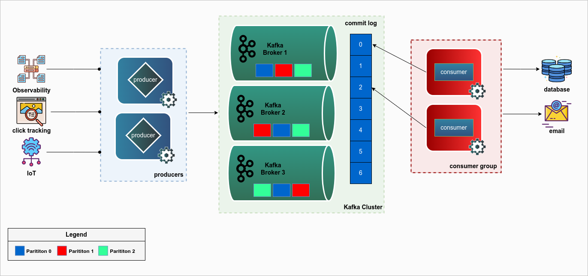

# Kafka One-Click CLUSTER


Apache Kafka is a robust, scalable, and high-performance system for managing real-time data streams. Its versatile architecture and feature set make it an essential component for modern data infrastructure, supporting a wide range of applications from log aggregation to real-time analytics and more. Whether you are building data pipelines, event-driven architectures, or stream processing applications, Kafka provides a reliable foundation for your data needs.

The manual deployment of Kafka is using Kafka's native consensus protocol, [KRaft](https://kafka.apache.org/documentation/#kraft). There are a few things to highligh from our deployment:

- While the provisioning, the cluster will be configured with mTLS for authentication. This means that inter-broker communication as well as client authentication is established via certificate identity
- The minimum cluster size is 3. At all times, 3 controllers are configured in the cluster for fault-tolerance.
- Clients that connect to the cluster will need their own valid certificate. All certificates are create with a self-signed Certicate Authority (CA). Client keystores and truststore are found on the first Kafka node in `/etc/kafka/ssl/keystore` and `/etc/kafka/ssl/truststore`
- The CA key and certificate pair are on the first Kafka node in `/etc/kafka/ssl/ca`

## Distributions

- Ubuntu 22.04 LTS

## Sotware Included

| Software  | Version   | Description   |
| :---      | :----     | :---          |
| Apache Kafka    | 3.8.0    | Scalable, high-performance, fault-tolerant streaming processing application  |
| KRaft | | Kafka native consensus protocol |
| UFW      | 0.36.1    | Uncomplicated Firewall |
| Fail2ban   | 0.11.2    | Bruteforce protection utility |

## Installation

Create a virtual environment to isolate dependencies from other packages on your system.

```
python3 -m venv env
source env/bin/activate
pip install -U pip
```

Install Ansible collections and required Python packages.

```
pip install -r requirements.txt
ansible-galaxy collection install -r collections.yml
```

## Setup

All secrets are encrypted with Ansible vault for best practices. To run the next commands you will need to export `VAULT_PASSWORD` so that secrets can be encrypted. Let's go ahead and export:

```command
export VAULT_PASSWORD=MyVaultPassword
```

Please replace `MyVaultPassword` with your own. 

Encrypt your Linode root password and valid APIv4 token with ansible-vault. Replace the value of @R34llyStr0ngP455w0rd! with your own strong password and `LINODE_TOKEN` with your own access token.

```
ansible-vault encrypt_string '@R34llyStr0ngP455w0rd!' --name 'root_password'
ansible-vault encrypt_string '@R34llyStr0ngP455w0rd!' --name 'sudo_password'
ansible-vault encrypt_string 'LINODE_TOKEN' --name 'api_token'
ansible-vault encrypt_string '@R34llyStr0ngP455w0rd!' --name 'truststore_password'
ansible-vault encrypt_string '@R34llyStr0ngP455w0rd!' --name 'keystore_password'
ansible-vault encrypt_string '@R34llyStr0ngP455w0rd!' --name 'ca_password'
```

Copy the generated outputs to the group_vars/kafka/secret_vars file.

```
root_password: !vault |
          $ANSIBLE_VAULT;1.1;AES256
          38306438386334663834633634363930343233373066353234616363356534653033346232333538
          3163313031373138383965383739356339663831613061660a666332636564356236656331323361
          61383134663166613462363633646330678356561386230383332313564643135343538383161383236
          6432396332643232620a393630633132336134613039666336326337376566383531393464303864
          34306435376534653961653739653232383262613336383837343962633565356546
sudo_password: !vault |
          $ANSIBLE_VAULT;1.1;AES256
          38306438386334663834633634363930343233373066353234616363356534653033346232333538
          3163313031373138383965383739356339663831613061660a666332636564356236656331323361
          61383134663166613462363633646330356561386230383332313564643135343538383161383236
          6432396332643232620a393630633sdf32336134613039666336326337376566383531393464303864
          34306435376534653961653739653232383262613336383837343962633565356546
api_token: !vault |
          $ANSIBLE_VAULT;1.1;AES256
          38306438386334663834633634363930343233373066353234616363356534653033346232333538
          3163313031373138383965383739356339663831613061660a666332636564356236656331323361
          6138313466316661346236363364567330356561386230383332313564643135343538383161383236
          6432396332643232620a393630633132336134613039666336326337376566383531393464303864
          34306435376534653961653739653232383262613336383837343962633565356546
truststore_password: !vault |
          $ANSIBLE_VAULT;1.1;AES256
          38306438386334663834633634363930343233373066353234616363356534653033346232333538
          3163313031373138383965383739356339663831613061660a666332636564356236656331323361
          6138313466316661346236363364567330356561386230383332313564643135343538383161383236
          6432396332643232620a393630633132336134613039666336326337376566383531393464303864
          34306435376534653961653739653232383262613336383837343962633565356546
keystore_password: !vault |
          $ANSIBLE_VAULT;1.1;AES256
          38306438386334663834633634363930343233373066353234616363356534653033346232333538
          3163313031373138383965383739356339663831613061660a666332636564356236656331323361
          6138313466316661346236363364567330356561386230383332313564643135343538383161383236
          6432396332643232620a393630633132336134613039666336326337376566383531393464303864
          34306435376534653961653739653232383262613336383837343962633565356546
ca_password: !vault |
          $ANSIBLE_VAULT;1.1;AES256
          38306438386334663834633634363930343233373066353234616363356534653033346232333538
          3163313031373138383965383739356339663831613061660a666332636564356236656331323361
          6138313466316661346236363364567330356561386230383332313564643135343538383161383236
          6432396332643232620a393630633132336134613039666336326337376566383531393464303864
          34306435376534653961653739653232383262613336383837343962633565356546                              
```

The first thing that we need to do is update the Linode instance parameters located in `group_vars/kafka/vars`. The following values need to be updated with your own values:

```
ssh_keys:
  - ssh-ed25519 AAAAC3NzaC1lZDI1NTE5AAAAIJQalZuAjeiWaPek5kJZxP4rTxuKlWgtSDFsdEGddf user1@desktop.local
  - ssh-rsa AAAAB3NzaC1yc2EAAAADAQABAAACAQCg2ANZcgWWFGh0vakgX1/xw== user2@desktop.local

instance_prefix: kafka
type: g6-dedicated-2
region: us-southeast
image: linode/ubuntu22.04
group:
linode_tags:

cluster_size: 3
client_count: 2
sudo_username: admin

#tls
country_name: US
state_or_province_name: Pennsylvania
locality_name: Philadelphia
organization_name: Akamai Technologies
email_address: webmaster@example.com
ca_common_name: Kafka RootCA
```

## Usage

Run `provision.yml` to stand up the compute instances and write your Ansible inventory to the hosts file. The playbook will complete when ssh becomes available on all instances.

```
ansible-playbook -vvv provision.yml"
```

Once that's complete you will see the following output:

```
PLAY RECAP ************************************************************************************************************************************************************************************************************************************************************
localhost                  : ok=6    changed=3    unreachable=0    failed=0    skipped=0    rescued=0    ignored=0
```

Next run the `site.yml` playbook with against the inventory file. This playbook will configure and install all required dependancies in for cluster.

```
ansible-playbook -vvv -i hosts site.yml
```

When the playbook is finished, you should see a similar output:

```
PLAY RECAP ************************************************************************************************************************************************************************************************************************************************************
192.155.94.186             : ok=25   changed=24   unreachable=0    failed=0    skipped=0    rescued=0    ignored=0   
23.239.17.165              : ok=25   changed=24   unreachable=0    failed=0    skipped=0    rescued=0    ignored=0   
45.33.102.196              : ok=49   changed=46   unreachable=0    failed=0    skipped=3    rescued=0    ignored=0
```

## Producing and Consuming Data

### Install Python Dependancy

Now that you have a Kafka cluster up an running on your account we can produce and consume messages from the brokers. First, we will need to install the following system package:

```command
sudo apt install confluent_kafka
```

### Obtain Client Certificate

Before we can send data to the Kafka broker we need to authenticate with our client certificates. You will need to grab the following files from the first kafka node, in this case **kafka1**, and put it in your local environment:

- `/etc/kafka/ssl/cert/client1.crt`
- `/etc/kafka/ssl/key/client1.key`
- `/etc/kafka/ssl/ca/ca-crt`

We will use these certificates to connect to the cluster in a secure and authenticated manner in the next section. 

### Produce Messages

Before we can send any data to the Kafka broker you will need to download both `produce.py` and `consume.py` scripts located in the `/script` directory of this repo.

- [produce.py](https://github.com/linode/docs-cloud-projects/blob/main/apps/manual-kafka-cluster/scripts/produce.py)
- [consume.py](https://github.com/linode/docs-cloud-projects/blob/main/apps/manual-kafka-cluster/scripts/consume.py)

Open the `produce.py` script and update the text **REPLACE_ME** with the IP address to one of your Kafka nodes. Once you save the file, you can run the script to send the sample data to the broker:

```
python3 produce.py
```

OUTPUT:
```
Message delivered to test [0] at offset 0
Message delivered to test [0] at offset 1
Message delivered to test [0] at offset 2
```
***NOTE:***

Make sure that `produce.py` and `consume.py` are in the same directory where the certicates are present. The script will look for the neccessary files granted that they are in the current working directory.

### Consume Messages

Consuming a message exactly the same procedure as above. Ensure that the `comsume.py` is updated to **REPLACE_ME** with the IP address to one of your Kafka nodes. Once that is complete, you can run the consumer script:

```
python3 consume.py
```

OUTPUT:
```
Received event: {'event_id': 0, 'timestamp': 1727888292, 'message': 'Event number 0'}
Received event: {'event_id': 1, 'timestamp': 1727888292, 'message': 'Event number 1'}
Received event: {'event_id': 2, 'timestamp': 1727888292, 'message': 'Event number 2'}
```